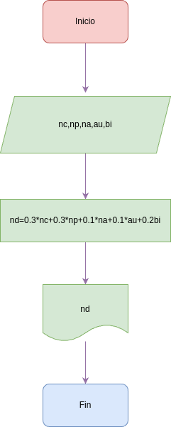

# Programa 1: nota_definitiva
Programam en Phython para Calcular la Nota Definitiva de una asignatura en el Colegio Guanentá

# Análisis

### Variables de entrada
- nc: Nota Cognitiva
- np: Nota Procedimental
- na: Nota Actitudinal
- au: Autoevaluacion
- bi: Bimestral

### Procesamiento
- nd: Nota Definitiva

$nd = 0.3*nc+0.3*np+0.1*na+0.1*au+0.2*bi$

## Diseño

## Construccion

- Codigo implementado en el archivo "definitive_note.py"
